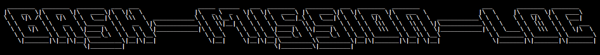
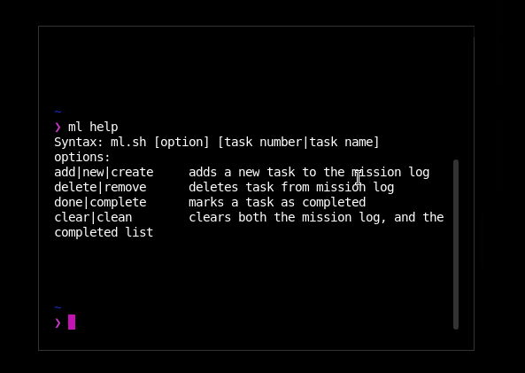
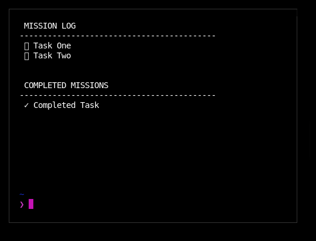

<h1 align="center">
  <br>
  <a href="https://github.com/hallindavid/bash-mission-log"></a>
  <br>
</h1>

<h4 align="center">a single file bash application that tracks your daily todo list in local files</h4>

<p align="center">
  <a href="#usage">usage</a> •
  <a href="#setup">setup</a> •
  <a href="#how-it-works">how it works</a> •
  <a href="#roadmap">roadmap</a> •
  <a href="#license">license</a>
</p>

<p align="center">
	
</p>

## privacy

This application stores the data in local text files.  There are no analytics, no tracking tools, no cloud that it syncs with.

There is a customizable sync in the roadmap, but it would be opt-in and you would configure your own database or sync system to support it.

## usage

This is a seriously simple way of tracking your daily goals.  The examples laid out below are based on setting up ml as an alias sudo apt install ghostwriter

#### creation
```bash
ml add this is  my new task
# or
ml create this is my new task
# or
ml new this is my new task
```

#### list
```bash
ml
# or
ml list
```

#### complete
```bash
ml done 2 
# or 
ml complete 2
# both will complete the second mission in your list, and move it to the completed section
```


#### delete
```bash
ml delete 3
# or
ml remove 3
# both will delete the third mission in your list, but not move it to the completed section
```

#### clean/clear the mission log
```bash
ml clear
# or
ml clean
```


#### help

```bash
ml help
```

## setup

To clone and run this application, you'll need [git](https://git-scm.com) installed. Put this somewhere you'll be OK leaving it (for example, you probably won't want it on the desktop)

```bash
# Clone this repository
git clone https://github.com/hallindavid/bash-mission-log

# make the ml.sh file executable
sudo chmod +x bash-mission-log/ml.sh

```

You have a few options for making the tool run globally on your system.

#### make an alias (recommended) - throw into your `.zshrc` or `.bashrc` file
```bash
alias ml="bash (path to directory)/ml.sh"

#then you can run from anywhere using the ml command

> ml help
```


#### add the directory to your PATH ( throw this into your `.zshrc` file or `.bashrc` file)
```bash
export PATH="$PATH: then the path you cloned into"

# then you can run from anywhere in the sytem using bash ml.sh
> bash ml.sh help
```

### making your mission-log appear when you open terminal

because this is just bash, you are able to add just one line into your `.zshrc` or `.bashrc` file to make it so that every time you open terminal, you are greeted with your mission log.

```bash
bash ml.sh #if you added the ml.sh to the path variable

ml # if you added an alias
```
note that you should do this at the end of your file, after you've created the alias, or exported the path

After doing this, each time you open terminal, you'll be greeted with something like this



## how it works

This bash script is actually super simple.
There are 2 text files that get created, `todo` and `complete`.

Each line in the `todo` file is considered a task, and each line in the `complete` file is considered a complete mission

the bash script takes a parameters like `add` or `delete` or `done` and adds/copies/removes that line from/to the files.

If you were wanting to do a complete backup of your tasks, you should be able to just take those 2 files, and copy them to where ever you'd like.

This is probably already fairly obvious, but there is no interenet required, and no online sync, this is a local-only system.  So if you're interested in privacy, this should work great for you.


## support

<a href="https://www.buymeacoffee.com/tDbQ4kg" target="_blank"></a>


## roadmap

There are a few more features that I'd like to work on.

#### Sync system
At the moment, there is no sync/backup system.  There are a few ways I am thinking of implementing, but basically all of these ideas would be utilized through a new command set, which I'm thinking of as `ml sync push` and `ml sync pull` and would store the configuration options in a local configuration file, likely `~/.mission-log-config`
- Remote database sync - this may be a re-write in Go, but you'd enter your database connection information into your configuration file, and then the sync would push/pull to and from that database.
- Git storage - identify a different path for your files in your configuration.  This would allow you to have a separate git repository which can be private, which stores your mission-log.  Then the sync commands would basically just cd into the configured directory, and then try to call git pull or git commit && push.

## license

MIT

---

> [davidhallin.com](https://www.davidhallin.com) &nbsp;&middot;&nbsp;
> GitHub [@hallindavid](https://github.com/hallindavid) &nbsp;&middot;&nbsp;
> Twitter [@david_hallin](https://twitter.com/david_hallin)

